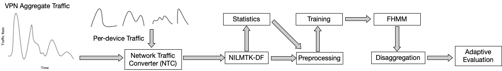

# 
TrafficSpy: Disaggregating VPN-encrypted IoT Network Traffic for User Privacy Inference

Qi Li, Keyang Yu, Dong Chen, Mo sha, Long Cheng

 

In Proc. of the 10th IEEE Conference on Communications and Network Security (IEEE CNS 2022).

 
People have been increasingly deploying the Internet of Things (IoT) devices to monitor and control their environments. Unfortunately, extensive recent research has shown that IoT devices are vulnerable to multiple adversarial attacks, which analyze their network traffic to reveal a wide range of sensitive private information about user in-home activities. Thus, smart home users recently have a keen interest in employing virtual private networks (VPN) to obscure their privacy information in their IoT network traffic. Our key insight is that VPN-encrypted IoT network traffic data is not anonymous, since this aggregate traffic data can still be disaggregated into individual IoT device traffic data. And this individual IoT device traffic may have an identifiable traffic signature that already embeds detailed user sensitive information. 

To explore the severity and extent of this privacy threat, we design a new factorial hidden Markov model (FHMM)- based smart home network traffic disaggregator—TrafficSpy that can accurately disaggregate VPN-encrypted whole-house IoT network traffic data into individual IoT device network traffic data. We evaluate TrafficSpy using VPN network traffic data from three smart homes. We find that TrafficSpy can disaggregate VPN traffic data into individual IoT device data accurately. We also show that the disaggregated traffic traces can be further attacked by smart and adaptive adversaries and thus reveal user sensitive information. TrafficSpy represents a serious privacy threat, but also a potentially useful tool that provides important contextual information for smart home monitoring and automation.
 

 
    
    
The system pipeline of TrafficSpy.

